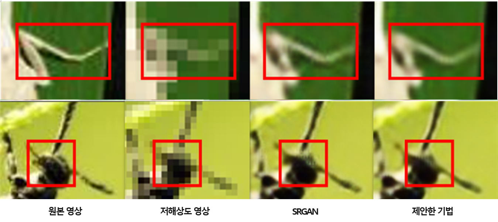

## Proposed Super Resolution
<li>Implementation of <a href="https://www.dbpia.co.kr/journal/articleDetail?nodeId=NODE11437908">잠재된 특징 지식 전이 기반의 해충 영상 초해상화</a> </li>
<li> The perception-driven super-resolution technique struggles to generate the feature distribution of the original high-resolution video because it learns high-level features from low-resolution input pictures. </li>
<li> we propose an autoencoder-based teacher network capable of learning the latent feature information of the original high-resolution pictures.</li>

## Proposed SRAN Architecture

## Generating Pretraining Data for Teacher Network

## Explain Data
<li>To train the proposed super-resolution model, we utilized the publicly available <a href="https://github.com/xpwu95/IP102">IP102 dataset</a>, which consists of a total of 102 classified insects, comprising a collection of 7,558 images. In this study, we removed unnecessary images, such as those containing only backgrounds or watermarks. The training and testing data were split in a 7:3 ratio, and data augmentation techniques, such as flipping and cropping transformations, were applied to prevent overfitting.</li>

## Training Environment
<li> python = 3.8.18 </li>
<li> pytorch = 1.9.1+cu11.1 </li>
<li> GPU = NVIDIA GeForce RTX 3060 </li>
<li> CPU = Ryzen 5 5600X 6-Core Processor </li>
<li> epoch = 200 </li>
<li> batch size = 10 </li>
<li> learning rate = 0.001 </li>
<li> optimizer = Adam </li>

## Evaluation
|      Methods      |   PSNR   |  SSIM  |
|      -------      |   ----   |  ----  |
|       SRGAN       |  30.263  | 0.8401 |
|  Proposed method  |  30.497  | 0.8420 |

## Results

